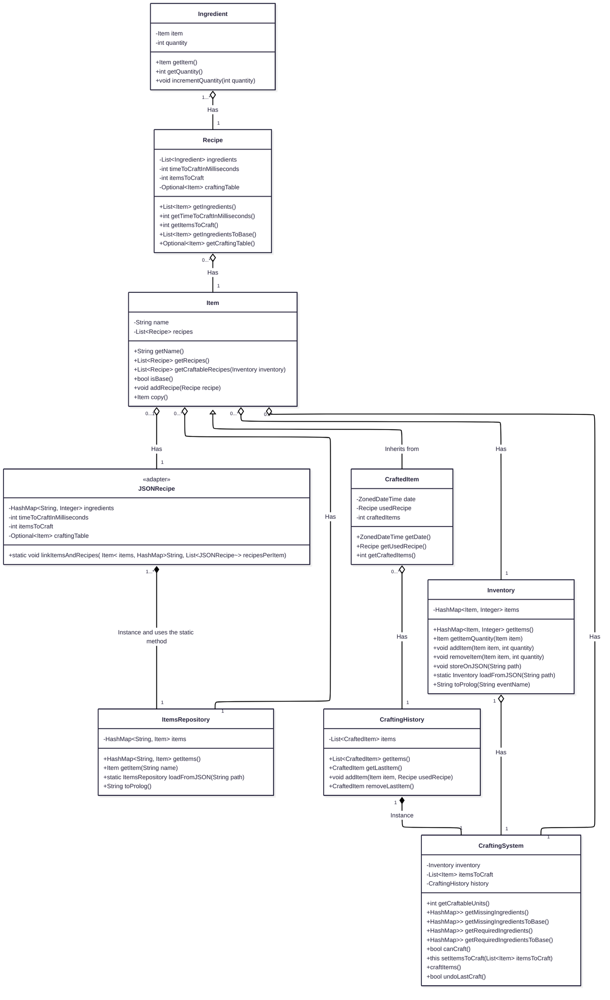
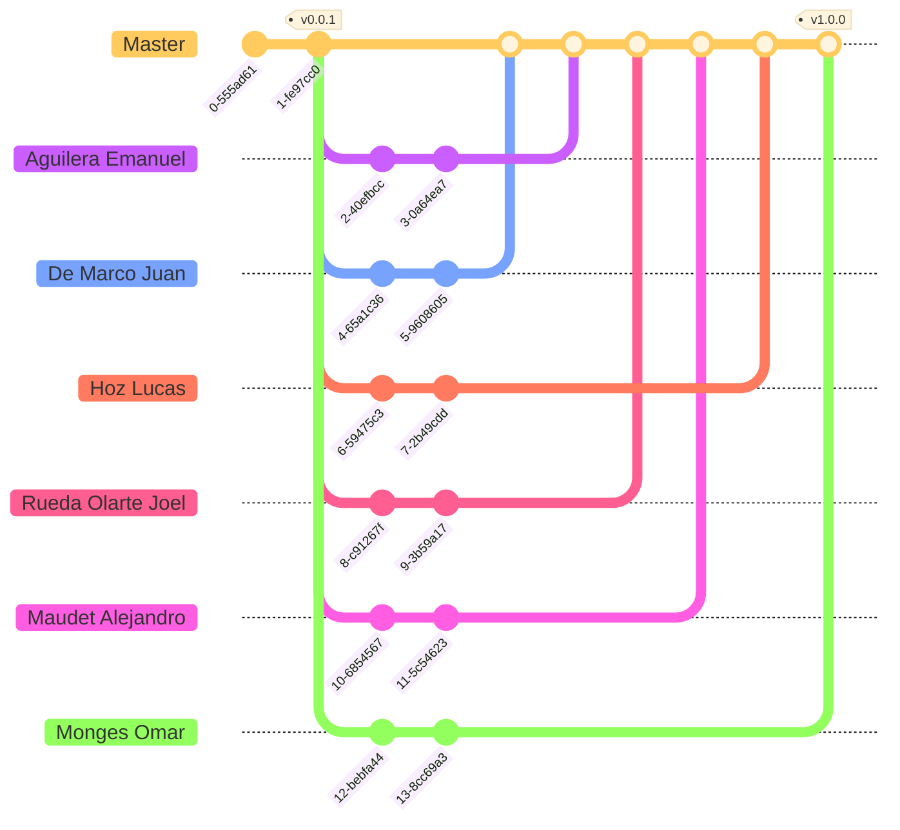

<h1 align="center">
    Java Practical Work [2025] [WIP] <!-- TODO -->
</h1>

    <strong>Repository for the practical work of the Programming Paradigms course</strong>
     
    <strong>- <a href="https://www.unlam.edu.ar/">UNLaM</a> (National University of La Matanza) -</strong>

    <a href="#summary">Summary</a> •
    <a href="#features">Features</a> •
    <a href="#installation">Installation</a> •
    <a href="#installation">Diagrams</a> •
    <a href="#team-workflow">Team workflow</a> •
    <a href="#development-team">Development team</a>
     
    <a href="#additional-material">Additional material</a> •
    <a href="#license">License</a> •
    <a href="#acknowledgments">Acknowledgments</a>

    <a href="./docs/translations/es/README.md">[ Spanish version ]</a>

    <a href="#"> <!-- TODO -->
        
    </a>

    <a href="#" target="_blank">(demonstration video)</a> <!-- TODO -->

## Summary

This repository contains the practical work for the Programming Paradigms course at the [National University of La Matanza (UNLaM)](https://www.unlam.edu.ar/). The practical work consists of doing a crafting system in Java and testing it with [JUnit 5](https://junit.org/junit5/).

## Features

-   Architecture planning
-   Code conventions and standards
-   Code documentation
-   Collections
-   Commits following the [Conventional Commits](https://www.conventionalcommits.org/en/v1.0.0/)
-   Deployment of releases
-   E2E testing with [JUnit 5](https://junit.org/junit5/)
-   File reading and interpretation
-   Input control using validations
-   Local storage of records
-   Team Workflow planning (branches, tags, and releases)
-   Unit testing with [JUnit 5](https://junit.org/junit5/)

## Installation

1. Clone the repository to your device and install [Eclipse IDE for Java developers](https://www.eclipse.org/downloads/packages/).
2. Open the cloned repository with Eclipse IDE and the [Index.java](./src/Main.java) file.
3. Then, press the green button (`Run index`) at the top of the navbar.
4. That's all, enjoy the crafting system through the interaction with the console.

How can I run all JUnit tests?

If you want to run all JUnit tests, you have to press `Right click` on the project within `Package explorer` of Eclipse IDE, and select `Run as` -> `JUnit Test`. That's all, Eclipse IDE will start running all the tests.

How can I change the inventory?

To change the items in the inventory, you have to update the [inventory.json](./src/assets/inventory.json) file with the desired ones.

> It's important to follow the same structure as the original ones, and these must be defined inside the [recipes.json](./src/assets/recipes.json) file.

How can I change the list of available items to craft?

To change the list of available items to craft, you must update the [recipes.json](./src/assets/recipes.json) file with the new craftable items.

> It's important to follow the same structure as the original ones.

## Diagrams

Class diagram

> [!NOTE]
> The diagrams were developed from scratch as part of the preliminary project reports.

## Team workflow

### Tags

-   `vMAJOR.MINOR.PATCH`: This tag indicates a [release](https://github.com/hozlucas28/Java-Practical-Work-2025/releases) of the practical work following [Semantic Versioning](https://semver.org/), and will only be present in the `Master` branch commits.

### Branches

-   `Master`: Branch containing the development versions of the practical work, where team members will introduce new changes (commits).

> [!IMPORTANT]
> Stable versions are only available as [releases](https://github.com/hozlucas28/Java-Practical-Work-2025/releases).

> [!NOTE]
> The other branches are fictional and represent individual contributions from each member to the `Master` branch.

## Development team

-   [Aguilera Emanuel](https://github.com/EmaaAg)
-   [Hoz Lucas](https://github.com/hozlucas28)
-   [De Marco Juan](https://github.com/juDemarco)
-   [Maudet Alejandro](https://github.com/Mabbdet)
-   [Monges Omar](https://github.com/Omar-Monges)
-   [Rueda Olarte Joel](https://github.com/joelalexisrueda)

## Additional material

-   [Practical work report](#) <!-- TODO -->
-   [Practical work requirements](./docs/translations/en/requirements.md)

## License

This repository is under the [MIT License](./LICENSE). For more information about what is permitted with the contents of this repository, visit [choosealicense.com](https://choosealicense.com/licenses/).

## Acknowledgments

We would like to thank the teachers from the [UNLaM](https://www.unlam.edu.ar/) Programming Paradigms course for their support and guidance.
