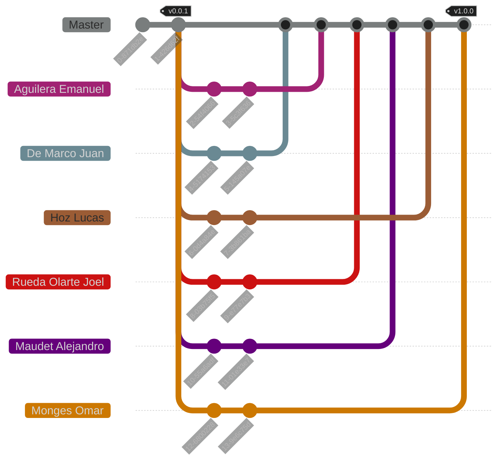

<h1 align="center">
    Java Practical Work [2025] [WIP] <!-- TODO -->
</h1>

    <strong>Repository for the practical work of the Programming Paradigms course</strong>
     
    <strong>- <a href="https://www.unlam.edu.ar/">UNLaM</a> (National University of La Matanza) -</strong>

    <a href="#summary">Summary</a> •
    <a href="#features">Features</a> •
    <a href="#installation">Installation</a> •
    <a href="#team-workflow">Team workflow</a> •
    <a href="#development-team">Development team</a> •
    <a href="#additional-material">Additional material</a>
     
    <a href="#license">License</a> •
    <a href="#acknowledgments">Acknowledgments</a>

    <a href="./docs/translations/es/README.md">[ Spanish version ]</a>

    <a href="#"> <!-- TODO -->
        
    </a>

    <a href="#" target="_blank">(demonstration video)</a> <!-- TODO -->

## Summary

This repository contains the practical work for the Programming Paradigms course at the [National University of La Matanza (UNLaM)](https://www.unlam.edu.ar/). The practical work consists of [TODO]. <!-- TODO -->

## Features

-   [TODO]. <!-- TODO -->

## Installation

1. [TODO]. <!-- TODO -->

## Team workflow

### Tags

-   `vMAJOR.MINOR.PATCH`: This tag indicates a [release](https://github.com/hozlucas28/Java-Practical-Work-2025/releases) of the practical work following [Semantic Versioning](https://semver.org/), and will only be present in the `Master` branch commits.

### Branches

-   `Master`: Branch containing the development versions of the practical work, where team members will introduce new changes (commits).

> [!IMPORTANT]
> Stable versions are only available as [releases](https://github.com/hozlucas28/Java-Practical-Work-2025/releases).

> [!NOTE]
> The other branches are fictional and represent individual contributions from each member to the `Master` branch.

## Development team

-   [Aguilera Emanuel](https://github.com/EmaaAg)
-   [Hoz Lucas](https://github.com/hozlucas28)
-   [De Marco Juan](https://github.com/juDemarco)
-   [Maudet Alejandro](https://github.com/Mabbdet)
-   [Monges Omar](https://github.com/Omar-Monges)
-   [Rueda Olarte Joel](https://github.com/joelalexisrueda)

## Additional material

-   [Practical work report](#) <!-- TODO -->
-   [Practical work requirements](./docs/translations/en/requirements.md)

## License

This repository is under the [MIT License](./LICENSE). For more information about what is permitted with the contents of this repository, visit [choosealicense.com](https://choosealicense.com/licenses/).

## Acknowledgments

We would like to thank the teachers from the [UNLaM](https://www.unlam.edu.ar/) Programming Paradigms course for their support and guidance.
