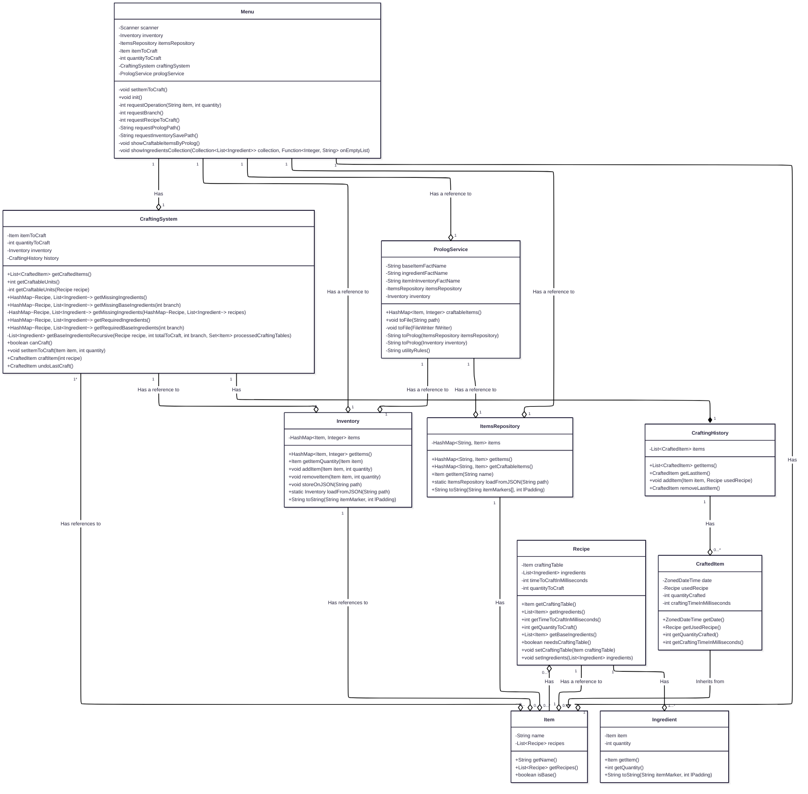
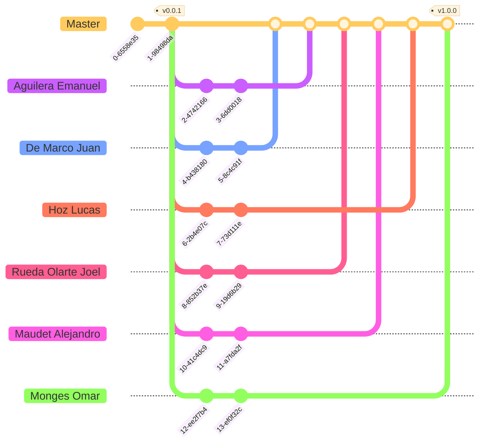

<h1 align="center">
    Trabajo Práctico de Java [2025]
</h1>

    <strong>Repositorio para el trabajo práctico del curso de Paradigmas de Programación</strong>
     
    <strong>- <a href="https://www.unlam.edu.ar/">UNLaM</a> (Universidad Nacional de La Matanza) -</strong>

    <a href="#summary">Resumen</a> •
    <a href="#features">Características</a> •
    <a href="#installation">Instalación</a> •
    <a href="#installation">Diagramas</a> •
    <a href="#team-workflow">Flujo de trabajo en equipo</a> •
    <a href="#development-team">Equipo de desarrollo</a>
     
    <a href="#additional-material">Material adicional</a> •
    <a href="#license">Licencia</a> •
    <a href="#acknowledgments">Agradecimientos</a>

    <a href="../../../README.md">[ Versión en inglés ]</a>

    

    <a href="https://youtu.be/-exAnyC0znc" target="_blank">(video de demostración)</a>

## Resumen

Este repositorio contiene el trabajo práctico para el curso de Paradigmas de Programación en la [Universidad Nacional de La Matanza (UNLaM)](https://www.unlam.edu.ar/). El trabajo práctico consiste en realizar un sistema de crafteo en Java y probarlo con [JUnit 5](https://junit.org/junit5/).

> [!TIP]
> Si desea leer una documentación extensa de cada proceso involucrado dentro del sistema, consulte la [página con la documentación dedicada](https://deepwiki.com/hozlucas28/Java-Practical-Work-2025).

## Características

-   Almacenamiento local de registros
-   Colecciones
-   Commits siguiendo el estándar [Conventional Commits](https://www.conventionalcommits.org/es/v1.0.0/)
-   Control de entradas mediante validaciones
-   Convenciones y estándares de código
-   Despliegue de versiones
-   Documentación del código usando la sintaxis de [JavaDoc](https://docs.oracle.com/javase/8/docs/technotes/tools/windows/javadoc.html)
-   Integración con [Prolog](https://www.swi-prolog.org/)
-   Lectura e interpretación de archivos
-   Página de [documentación dedicada](https://deepwiki.com/hozlucas28/Java-Practical-Work-2025)
-   Planificación de arquitectura
-   Planificación del flujo de trabajo en equipo (ramas, etiquetas y versiones)
-   Pruebas E2E con [JUnit 5](https://junit.org/junit5/)
-   Pruebas unitarias con [JUnit 5](https://junit.org/junit5/)

## Instalación

1. Descarga el [código fuente del último release](https://github.com/hozlucas28/Java-Practical-Work-2025/releases) (`zip version`) en tu dispositivo.
2. Instala [Java](https://www.java.com/en/download/) y [Prolog](https://www.swi-prolog.org/download/stable) (marca la opción `Add swipl to the system PATH` durante la instalación).
3. Instala [Eclipse IDE for Java developers](https://www.eclipse.org/downloads/packages/).
4. Abre el código fuente descargado con Eclipse IDE.
5. Luego, haz clic derecho sobre el archivo [Main.java](../../../src/Main.java) y selecciona `Run As` -> `Java Application`.
6. Eso es todo, disfruta del sistema de crafteo a través de la interacción con la consola.

¿Cómo puedo ejecutar todas las pruebas JUnit?

Si deseas ejecutar todas las pruebas JUnit, debes hacer clic derecho sobre el proyecto dentro del `Package explorer` de Eclipse IDE, y seleccionar `Run as` -> `JUnit Test`. Eso es todo, Eclipse IDE comenzará a ejecutar todas las pruebas.

¿Cómo puedo cambiar el inventario?

Para cambiar los ítems del inventario, debes actualizar el archivo [inventory.json](../../../src/assets/inventory.json) con los ítems deseados.

> Es importante seguir la misma estructura que los originales, y estos deben estar definidos dentro del archivo [recipes.json](../../../src/assets/recipes.json).

¿Cómo puedo cambiar la lista de ítems disponibles para craftear?

Para cambiar la lista de ítems disponibles para craftear, debes actualizar el archivo [recipes.json](../../../src/assets/recipes.json) con los nuevos ítems crafteables.

> Es importante seguir la misma estructura que los originales.

### Problemas conocidos

| Problema                               | Solución                                                                                                                                                                                                                                                                                                                                                                                                                                                                                                                                                                                                                                                    |
| :------------------------------------- | :------------------------------------------------------------------------------------------------------------------------------------------------------------------------------------------------------------------------------------------------------------------------------------------------------------------------------------------------------------------------------------------------------------------------------------------------------------------------------------------------------------------------------------------------------------------------------------------------------------------------------------------------------------ |
| Prolog no puede encontrar recursos del sistema | _En Eclipse IDE, ve a la pestaña `File` y selecciona la opción `Import`. Luego, debes buscar `Launch configurations`, seleccionarla y presionar `Next`. Después, busca el directorio del proyecto, selecciona los archivos `Java-Practical-Work-2025`, `Main`, y `PrologServiceTests` y marca la opción `Overwrite existing launch configurations without warning.`. Finalmente, presiona `Finish` para cargar tu instancia local de Prolog. Si esto no funcionó, revisa el valor de cada variable de entorno dentro de la pestaña `Environment` en cada configuración de ejecución de `Java-Practical-Work-2025`, `Main`, y `PrologServiceTests`, ya que deben apuntar a tu directorio local de Prolog._ |

## Diagramas

Diagrama de clases

> [!NOTE]
> Los diagramas fueron desarrollados desde cero como parte de los informes preliminares del proyecto.

## Flujo de trabajo en equipo

### Etiquetas

-   `vMAJOR.MINOR.PATCH`: Esta etiqueta indica una [versión](https://github.com/hozlucas28/Java-Practical-Work-2025/releases) del trabajo práctico siguiendo [Semantic Versioning](https://semver.org/), y solo estará presente en los commits de la rama `Master`.

### Ramas

-   `Master`: Rama que contiene las versiones de desarrollo del trabajo práctico, donde los miembros del equipo introducirán nuevos cambios (commits).

> [!IMPORTANT]
> Las versiones estables solo están disponibles como [releases](https://github.com/hozlucas28/Java-Practical-Work-2025/releases).

> [!NOTE]
> Las demás ramas son ficticias y representan las contribuciones individuales de cada miembro a la rama `Master`.

## Equipo de desarrollo

-   [Aguilera Emanuel](https://github.com/EmaaAg)
-   [Hoz Lucas](https://github.com/hozlucas28)
-   [De Marco Juan](https://github.com/juDemarco)
-   [Maudet Alejandro](https://github.com/Mabbdet)
-   [Monges Omar](https://github.com/Omar-Monges)
-   [Rueda Olarte Joel](https://github.com/joelalexisrueda)

## Material adicional

-   [Informe del trabajo práctico](../../assets/report.pdf)
-   [Requerimientos del trabajo práctico](./requirements.md)

## Licencia

Este repositorio está bajo la [Licencia MIT](./LICENSE). Para más información sobre lo que está permitido con el contenido de este repositorio, visita [choosealicense.com](https://choosealicense.com/licenses/).

## Agradecimientos

Queremos agradecer a los docentes del curso de Paradigmas de Programación de la [UNLaM](https://www.unlam.edu.ar/) por su apoyo y guía.
